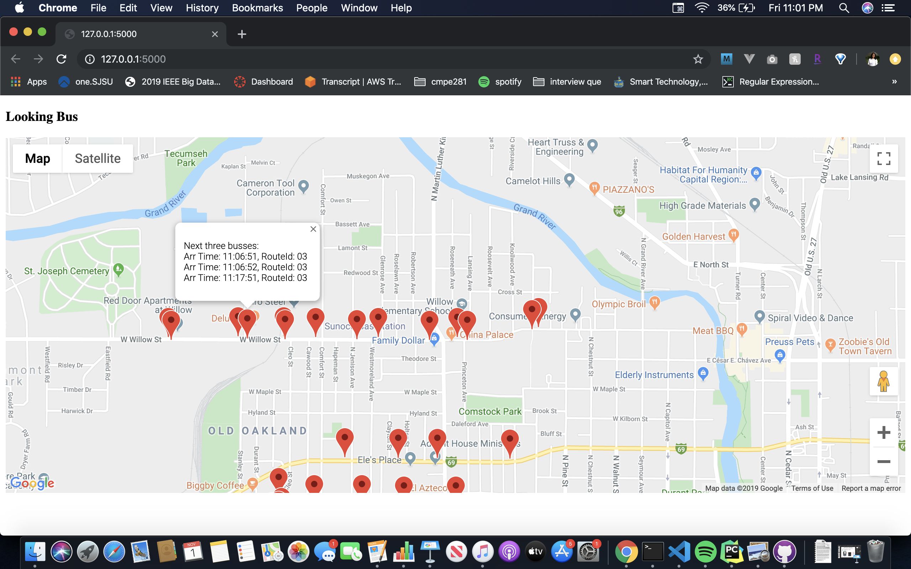

# LookingBus
 
This is a python programming test. I have created a Python Flask Application to diaplay bus stops within 1km radius of the user location. On clicking the Marker, information of next three bus arrival time with their route IDs is displayed. 

  - The map is displayed using a HTML template.
  - I have used Google API to display the map.
  - The first fetch call is used to get the stop IDs within a range of 1km of the user. The POST request sents the user latitude and longitude.
  - The JSON response is a dictionary of nearby stop locations.
  - Each location is marked by a marker.
  - A listner is attched to each marker, which makes a fetch call to get next three buss routes and times at that stop.
  - The fetch call sends the user time and stopID
  - The response is a JSON which is displayed on the information Window.
 
 
